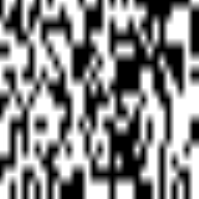

# Multimodal-Fusion-Strategy-to-Classify-Malware
This work focuses on proposing a novel approach towards classifying malware binaries by extracting visual features from malware executables. 

The dataset used in this work is from Kaggle Challenge for Malware Classification, Big2015.

Big2015 Malware Dataset consists of 9 families and 10,868 malware binary samples. Big2015 is a highly unbalanced dataset, with few families having more than 2000 malware samples, few more 1000 and others below 500. 

First malware visual representation we use in this work is Grayscale image, which is generated using the decimal represenation of the hex code that was extracted from the malware executables using Hex Dump Tool. 

 

The above image is an example snippet of the hexadecimal values extracted from Hex codes of a malware sample and the decimal values. 

The below logic was used to convert Hex codes into hexadecimal values. (refer to [hex_HDec.py](scripts/hex_hDec.py))
```bash
    import re
       hex_regex = r'\b[0-9A-F]{2}\b'
       hex_codes = re.findall(hex_regex, contents)
       hex_str = ""
       for ele in hex_codes:
         hex_str += ele 
```

To convert Hexadecimal to decimal, we used the below set of code. (refer to [HDec_Dec.py](scripts/HDec_dec.py))
```bash
    table = {'0': 0, '1': 1, '2': 2, '3': 3,
      '4': 4, '5': 5, '6': 6, '7': 7,
      '8': 8, '9': 9, 'A': 10, 'B': 11,
      'C': 12, 'D': 13, 'E': 14, 'F': 15}
    dec_list = []
    for ele in hex_list:
      hexadecimal = ele.strip().upper()
      res = 0
      size = len(hexadecimal) - 1
      for num in hexadecimal:
        res = res + table[num]*16**size
        size = size - 1
      dec_list.append(res)
```

### Grayscale Image (GS)

The extracted Hexadecimal values are then convereted into decimal which is then used to generate Grayscale (GS) Images. Preview the code to generate GS images in [GS_Img.py](scripts/GS_Img.py)

Example of Grayscale Image (Simda & Lollipop) : 


The generated grayscale images are now used to train an independent VGG-16 Model. We chose VGG-16 model beacause, among the deep convolutional neural network models, VGG-16 is the most light-weighted comparing to ResNet-50, InceptionNet etc.

### Entropy Graph (EG)

Entropy Graph is also generated from the same decimal values that are converted fromhexadecimal extracted from the Hex code of each malware sample. In computing, entropy is the randomness collected by an operating system or application for use in cryptography or other uses that require random data.

Below is the logic used for entropy extraction from decimal values: 
```bash
    # creating an average entropy list of all the segments in the array 
    import math
    segment_size = 256
    averages = []
    for i in range(0, len(arr), segment_size):
      subset = arr[i:i+segment_size]
      entropy = 0
      for element in subset:
        prob = np.unique(element, return_counts = True)
        entropy += en(prob)
      average_entropy = entropy / segment_size
      average_entropy = float(average_entropy)
      averages.append(average_entropy)
      #average_str = str(average_entropy)
```

Run [EntropyGraph.py](scripts/EntropyGraph.py) to generate Entropy Graph from decimal values of malware samples.

Example of Entropy Graph (Vundo & Kelihos_ver3) : 


### Simhash Image (SH)

Simhash Images used in this work are generated not like Grayscale or Entropy from decimal. Rather, we utilize the assembly code of a malware sample to extract the operational code which is then passed through hash functions like MD5 to generate simhash images. 

Example of Simhash Image (Kelihos_ver3 & Vundo) : 

.png) 


## Experiment 1 : 
The below table shows the performance of all Grayscale(GS), Entropy Graph(EG) and Simhash (SH) VGG-16 Indepedent Models. 

| Feature | Accuracy | Precision | Recall | F1-Score | Time |
| --- | --- | --- | --- | --- | --- |
| GS | 0.998 | 1.0 | 0.996 | 0.997 | 0.01 |
| EG | 0.999 | 0.998 | 0.998 | 0.998 | 0.01 |
| SH | 0.996 | 0.966 | 0.963 | 0.963 | 0.01 |

