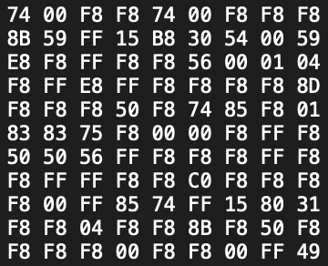
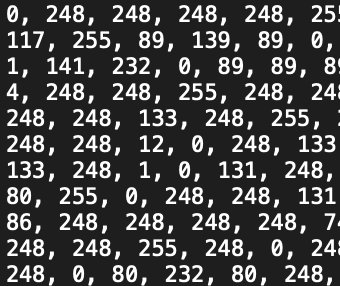

# Multimodal-Fusion-Strategy-to-Classify-Malware
This work focuses on proposing a novel approach towards classifying malware binaries by extracting visual features from malware executables. 

The dataset used in this work is from Kaggle Challenge for Malware Classification, Big2015.

Big2015 Malware Dataset consists of 9 families and 10,868 malware binary samples. Big2015 is a highly unbalanced dataset, with few families having more than 2000 malware samples, few more 1000 and others below 500. 

## Experiment 1 : 
First malware visual representation we use in this work is Grayscale image, which is generated using the decimal represenation of the hex code that was extracted from the malware executables using Hex Dump Tool. 

 



The above image is an example snippet of the hexadecimal values extracted from Hex codes of a malware sample and the decimal values. 

The below logic was used to convert Hex codes into hexadecimal values. (refer to [hex_HDec](scripts/hex_hDec.py))
```bash
    import re
       hex_regex = r'\b[0-9A-F]{2}\b'
       hex_codes = re.findall(hex_regex, contents)
       hex_str = ""
       for ele in hex_codes:
         hex_str += ele 
```


The extracted Hexadecimal values are then convereted into decimal which is then used to generate Grayscale (GS) Images. 